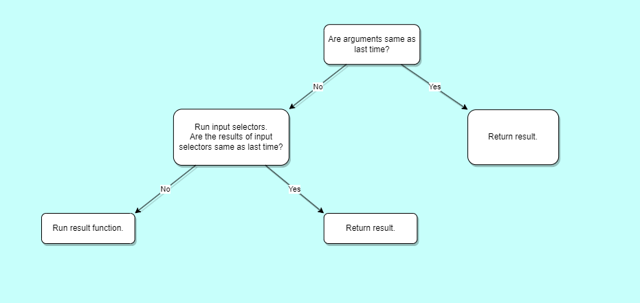

# Reselect

[![npm package][npm-badge]][npm][![Coveralls][coveralls-badge]][coveralls][![GitHub Workflow Status][build-badge]][build]![TypeScript][typescript-badge]

A library for creating memoized "selector" functions. Commonly used with Redux, but usable with any plain JS immutable data as well.

- Selectors can compute derived data, allowing `Redux` to store the minimal possible state.
- Selectors are efficient. A selector is not recomputed unless one of its arguments changes.
- Selectors are composable. They can be used as input to other selectors.

The **Redux docs usage page on [Deriving Data with Selectors](https://redux.js.org/usage/deriving-data-selectors)** covers the purpose and motivation for selectors, why memoized selectors are useful, typical `Reselect` usage patterns, and using selectors with `React-Redux`.

## Installation

### Redux Toolkit

While `Reselect` is not exclusive to `Redux`, it is already included by default in [the official Redux Toolkit package](https://redux-toolkit.js.org) - no further installation needed.

```ts
import { createSelector } from '@reduxjs/toolkit'
```

### Standalone

For standalone usage, install the `Reselect` package:

#### Using `npm`

```bash
npm install reselect
```

#### Using `yarn`

```bash
yarn add reselect
```

#### Using `bun`

```bash
bun add reselect
```

#### Using `pnpm`

```bash
pnpm add reselect
```

---

## Basic Usage

`Reselect` exports a [`createSelector`] API, which generates memoized selector functions. [`createSelector`] accepts one or more [`input selectors`], which extract values from arguments, and a [`combiner`] function that receives the extracted values and should return a derived value. If the generated [`output selector`] is called multiple times, the output will only be recalculated when the extracted values have changed.

You can play around with the following **example** in [this CodeSandbox](https://codesandbox.io/s/reselect-example-g3k9gf?file=/src/index.js):

```ts
import { createSelector } from 'reselect'

interface RootState {
  todos: { id: number; completed: boolean }[]
  alerts: { id: number; read: boolean }[]
}

const state: RootState = {
  todos: [
    { id: 0, completed: false },
    { id: 1, completed: true }
  ],
  alerts: [
    { id: 0, read: false },
    { id: 1, read: true }
  ]
}

const selectCompletedTodos = (state: RootState) => {
  console.log('selector ran')
  return state.todos.filter(todo => todo.completed === true)
}

selectCompletedTodos(state) // selector ran
selectCompletedTodos(state) // selector ran
selectCompletedTodos(state) // selector ran

const memoizedSelectCompletedTodos = createSelector(
  [(state: RootState) => state.todos],
  todos => {
    console.log('memoized selector ran')
    return todos.filter(todo => todo.completed === true)
  }
)

memoizedSelectCompletedTodos(state) // memoized selector ran
memoizedSelectCompletedTodos(state)
memoizedSelectCompletedTodos(state)

console.log(selectCompletedTodos(state) === selectCompletedTodos(state)) //=> false

console.log(
  memoizedSelectCompletedTodos(state) === memoizedSelectCompletedTodos(state)
) //=> true
```

As you can see from the example above, `memoizedSelectCompletedTodos` does not run the second or third time, but we still get the same return value as last time.

Another difference is that with `memoizedSelectCompletedTodos` the referential integrity of the return value is also maintained through multiple calls of the selector, but the same cannot be said about the first example.

---

## Table of Contents

- [Installation](#installation)
  - [Redux Toolkit](#redux-toolkit)
  - [Standalone](#standalone)
- [Basic Usage](#basic-usage)
- [Terminology](#terminology)
- [How Does `Reselect` Work?](#how-does-reselect-work)
  - [Cascading Memoization](#cascading-memoization)
  - [`Reselect` Vs Standard Memoization](#reselect-vs-standard-memoization)
  - [Why `Reselect` Is Often Used With `Redux`](#why-reselect-is-often-used-with-redux)
- [API](#api)
  - [**`createSelector`**][`createSelector`]
  - [**`defaultMemoize`**][`defaultMemoize`]
  - [**`weakMapMemoize`**][`weakMapMemoize`]
  - [**`autotrackMemoize`**][`autotrackMemoize`]
  - [**`createSelectorCreator`**][`createSelectorCreator`]
  - [**`createStructuredSelector`**][`createStructuredSelector`]
  - [**`createCurriedSelector`**][`createCurriedSelector`]
- [Debugging Tools](#debuggingtools)
- [What's New in 5.0.0?](#v5summary)
- [Optimizing `Reselect`](#optimizing-reselect)
- [FAQ](#faq)
  - [Why isn’t my selector recomputing when the input state changes?](#why-isnt-my-selector-recomputing-when-the-input-state-changes)
  - [Why is my selector recomputing when the input state stays the same?](#why-is-my-selector-recomputing-when-the-input-state-stays-the-same)
  - [Can I use `Reselect` without `Redux`?](#can-i-use-reselect-without-redux)
  - [How do I create a selector that takes an argument?](#how-do-i-create-a-selector-that-takes-an-argument)
  - [The default memoization function is no good, can I use a different one?](#the-default-memoization-function-is-no-good-can-i-use-a-different-one)
  - [How do I test a selector?](#how-do-i-test-a-selector)
  - [Can I share a selector across multiple component instances?](#can-i-share-a-selector-across-multiple-component-instances)
  - [Are there TypeScript Typings?](#are-there-typescript-typings)
  - [I am seeing a TypeScript error: `Type instantiation is excessively deep and possibly infinite`](#i-am-seeing-a-typescript-error-type-instantiation-is-excessively-deep-and-possibly-infinite)
  - [How can I make a curried selector?](#how-can-i-make-a-curried-selector)
  - [How can I make pre-typed version of `createSelector` for my root state?](#how-can-i-make-pre-typed-version-of-createselector-for-my-root-state)
  - [What if I want to use `createSelector` without memoization?](#what-if-i-want-to-use-createselector-without-memoization)
- [External References](#external-references)
- [Related Projects](#related-projects)
- [License](#license)
- [Prior Art and Inspiration](#prior-art-and-inspiration)

---

## Terminology

<details><summary><b>Click to expand</b></summary>

- <a name="selector-function"></a>[**`Selector Function`**](#selector-function): A function that takes the `Redux` store state (or a part of it) as an argument and returns data derived from that state.
- <a name="input-selectors"></a>[**`input selectors`**](#input-selectors): Basic selector functions used as building blocks for creating a memoized selector. They are passed as the first argument(s) to [`createSelector`].
- <a name="output-selector"></a>[**`Output Selector`**](#output-selector): The actual memoized selectors created by [`createSelector`].
- <a name="result-function"></a>[**`Result Function (Combiner)`**](#result-function): The function that comes after the [`input selectors`]. It takes the [`input selectors`]' return values as arguments and returns a result. Otherwise known as the `combiner`.
- <a name="combiner"></a>[**`Combiner`**](#combiner): A function that takes [`input selectors`]' return values as arguments and returns a result (This function comes after the [`input selectors`] inside [`createSelector`]). This term is somewhat interchangeably used with `Result Function` or `resultFunc`. But `combiner` is more of a general term and `resultFunc` is more specific to `Reselect`. So the `resultFunc` is a `combiner` but a `combiner` is not necessarily the same as `resultFunc`. For the sake of simplicity, they are used synonymously throughout this documentation.
- <a name="dependencies"></a>[**`Dependencies`**](#dependencies): Same as [`input selectors`]. They are what the [`output selector`] "depends" on.

The below example serves as a visual aid:

```ts
const outputSelector = createSelector(
  [inputSelector1, inputSelector2, inputSelector3], // synonymous with `dependencies`.
  combiner // synonymous with `Result Function` or `resultFunc`.
)
```

</details>

<div align="right">[ <a href="#table-of-contents">↑ Back to top ↑</a> ]</div>

---

## How Does `Reselect` Work?

<a id="cascadingmemoization"></a>

### Cascading Memoization

<details><summary><b>Click to expand</b></summary>

The way `Reselect` works can be broken down into multiple parts:

1. **Initial Run**: On the first call, `Reselect` runs all the [`input selectors`], gathers their results, and passes them to the [`result function`].

2. **Subsequent Runs**: For subsequent calls, `Reselect` performs two levels of checks:

   - **First Level**: It compares the current arguments with the previous ones (done by `argsMemoize`).

     - If they're the same, it returns the cached result without running the [`input selectors`] or the [`result function`].

     - If they differ, it proceeds to the second level.

   - **Second Level**: It runs the [`input selectors`] and compares their current results with the previous ones (done by `memoize`).
     > [!NOTE]
     > If any one of the [`input selectors`] return a different result, all [`input selectors`] will recalculate.
     - If the results are the same, it returns the cached result without running the [`result function`].
     - If the results differ, it runs the [`result function`].

This behavior is what we call **_Cascading Double-Layer Memoization_**.

</details>

### `Reselect` Vs Standard Memoization

<details><summary><b>Click to expand</b></summary>

##### Standard Memoization


_Standard memoization only compares arguments. If they're the same, it returns the cached result._

##### Memoization with `Reselect`



_`Reselect` adds a second layer of checks with the [`input selectors`]. This is crucial in `Redux` applications where state references change frequently._

A normal [memoization] function will compare the arguments, and if they are the same as last time, it will skip running the function and return the cached result. However, `Reselect` enhances this by introducing a second tier of checks via its [`input selectors`]. It's possible that the arguments passed to these [`input selectors`] may change, yet their results remain the same. When this occurs, `Reselect` avoids re-executing the [`result function`], and returns the cached result.

This feature becomes crucial in `Redux` applications, where the `state` changes its reference anytime an `action` is dispatched.

> [!NOTE]
> The [`input selectors`] take the same arguments as the [`output selector`].

### Why `Reselect` Is Often Used With `Redux`

Imagine you have a selector like this:

```ts
const selectCompletedTodos = (state: RootState) =>
  state.todos.filter(todo => todo.completed === true)
```

So you decide to memoize it:

```ts
const selectCompletedTodos = someMemoizeFunction((state: RootState) =>
  state.todos.filter(todo => todo.completed === true)
)
```

Then you update `state.alerts`:

```ts
store.dispatch(toggleRead(0))
```

Now when you call `selectCompletedTodos`, it re-runs, because we have effectively broken memoization.

```ts
selectCompletedTodos(store.getState())
selectCompletedTodos(store.getState()) // Will not run, and the cached result will be returned.
store.dispatch(toggleRead(0))
selectCompletedTodos(store.getState()) // It recalculates.
```

But why? `selectCompletedTodos` only needs to access `state.todos`, and has nothing to do with `state.alerts`, so why have we broken memoization? Well that's because in `Redux` anytime you make a change to the root `state`, it gets shallowly updated, which means its reference changes, therefore a normal memoization function will always fail the comparison check on the arguments.

But with `Reselect`, we can do something like this:

```ts
const selectCompletedTodos = createSelector(
  [(state: RootState) => state.todos],
  todos => todos.filter(todo => todo.completed === true)
)
```

And now we have achieved memoization:

```ts
selectCompletedTodos(store.getState())
selectCompletedTodos(store.getState()) // Will not run, and the cached result will be returned.
store.dispatch(toggleRead(0))
selectCompletedTodos(store.getState()) // The `input selectors` will run, But the `result function` is skipped and the cached result will be returned.
```

Even when the overall `state` changes, `Reselect` ensures efficient memoization through its unique approach. The [`result function`] doesn't re-run if the relevant part of the `state` (in this case `state.todos`), remains unchanged. This is due to `Reselect`'s [**_Cascading Double-Layer Memoization_**][**_Cascading Memoization_**]. The first layer checks the entire `state`, and the second layer checks the results of the [`input selectors`]. If the first layer fails (due to a change in the overall `state`) but the second layer succeeds (because `state.todos` is unchanged), `Reselect` skips recalculating the [`result function`]. This dual-check mechanism makes `Reselect` particularly effective in `Redux` applications, ensuring computations are only done when truly necessary.

</details>

<div align="right">[ <a href="#table-of-contents">↑ Back to top ↑</a> ]</div>

---

## API

<a id="createselector"></a>

### createSelector(...inputSelectors | [inputSelectors], resultFunc, createSelectorOptions?)

<details><summary><b>Description</b></summary>

Accepts one or more ["input selectors"][`input selectors`] (either as separate arguments or a single array),
a single ["result function"][`result function`] / ["combiner"][`combiner`], and an optional options object, and
generates a memoized selector function.

</details>

<details><summary><b>Parameters</b></summary>

| Name                     | Description                                                                                      |
| :----------------------- | :----------------------------------------------------------------------------------------------- |
| `inputSelectors`         | An array of [`input selectors`], can also be passed as separate arguments.                       |
| `combiner`               | A [`combiner`] function that takes the results of the [`input selectors`] as separate arguments. |
| `createSelectorOptions?` | An optional options object that allows for further customization per selector.                   |

</details>

<details><summary><b>Returns</b></summary>

A memoized [`output selector`].

</details>

<details><summary><b>Type parameters</b></summary>

| Name                          | Description                                                                                                                                                                                            |
| :---------------------------- | :----------------------------------------------------------------------------------------------------------------------------------------------------------------------------------------------------- |
| `InputSelectors`              | The type of the [`input selectors`] array.                                                                                                                                                             |
| `Result`                      | The return type of the [`combiner`] as well as the [`output selector`].                                                                                                                                |
| `OverrideMemoizeFunction`     | The type of the optional `memoize` function that could be passed into the options object to override the original `memoize` function that was initially passed into [`createSelectorCreator`].         |
| `OverrideArgsMemoizeFunction` | The type of the optional `argsMemoize` function that could be passed into the options object to override the original `argsMemoize` function that was initially passed into [`createSelectorCreator`]. |

</details>

<div align="right">[ <a href="#table-of-contents">↑ Back to top ↑</a> ]</div>

---

### Memoization Functions

<a id="defaultmemoize"></a>

#### defaultMemoize(func, equalityCheckOrOptions = defaultEqualityCheck)

<details><summary><b>Description</b></summary>

The standard memoize function used by [`createSelector`].

It has a default cache size of 1. This means it always recalculates when the value of an argument changes. However, this can be customized as needed with a specific max cache size (**`Since`** 4.1.0).

It determines if an argument has changed by calling the `equalityCheck` function. As `defaultMemoize` is designed to be used with immutable data, the default `equalityCheck` function checks for changes using [`reference equality`][Reference Equality Check]:

```ts
const defaultEqualityCheck = (previousValue: any, currentValue: any) => {
  return previousValue === currentValue
}
```

</details>

<details><summary><b>Parameters</b></summary>

| Name                     | Description                                                 |
| :----------------------- | :---------------------------------------------------------- |
| `func`                   | The function to be memoized.                                |
| `equalityCheckOrOptions` | Either an `equality check` function or an `options` object. |

**`Since`** 4.1.0, `defaultMemoize` also accepts an options object as its first argument instead of an `equalityCheck` function. The `options` object may contain:

```ts
type EqualityFn = (a: any, b: any) => boolean

interface DefaultMemoizeOptions {
  equalityCheck?: EqualityFn
  resultEqualityCheck?: EqualityFn
  maxSize?: number
}
```

| Name                  | Description                                                                                                                                                                                                                                                                                                                                                                         |
| :-------------------- | :---------------------------------------------------------------------------------------------------------------------------------------------------------------------------------------------------------------------------------------------------------------------------------------------------------------------------------------------------------------------------------- |
| `equalityCheck`       | Used to compare the individual arguments of the provided calculation function. <br /> **`Default`** = `defaultEqualityCheck`                                                                                                                                                                                                                                                        |
| `resultEqualityCheck` | If provided, used to compare a newly generated output value against previous values in the cache. If a match is found, the old value is returned. This addresses the common <code>todos.map(todo => todo.id)</code> use case, where an update to another field in the original data causes a recalculation due to changed references, but the output is still effectively the same. |
| `maxSize`             | The cache size for the selector. If greater than 1, the selector will use an LRU cache internally. <br /> **`Default`** = 1                                                                                                                                                                                                                                                         |

> [!WARNING]
> If `resultEqualityCheck` is used inside `argsMemoizeOptions` it has no effect.

</details>

<details><summary><b>Returns</b></summary>

A memoized function with a `.clearCache()` method attached.

</details>

<details><summary><b>Type parameters</b></summary>

| Name   | Description                                |
| :----- | :----------------------------------------- |
| `Func` | The type of the function that is memoized. |

</details>

<details><summary><b><code>Examples</code></b></summary>

###### Using [`createSelector`]

```ts
import { shallowEqual } from 'react-redux'
import { createSelector } from 'reselect'

const selectTodoIds = createSelector(
  [(state: RootState) => state.todos],
  todos => todos.map(todo => todo.id),
  {
    memoizeOptions: {
      equalityCheck: shallowEqual,
      resultEqualityCheck: shallowEqual,
      maxSize: 10
    },
    argsMemoizeOptions: {
      equalityCheck: shallowEqual,
      resultEqualityCheck: shallowEqual,
      maxSize: 10
    }
  }
)
```

###### Using [`createSelectorCreator`]

```ts
import { shallowEqual } from 'react-redux'
import { createSelectorCreator, defaultMemoize } from 'reselect'

const createSelectorShallowEqual = createSelectorCreator({
  memoize: defaultMemoize,
  memoizeOptions: {
    equalityCheck: shallowEqual,
    resultEqualityCheck: shallowEqual,
    maxSize: 10
  },
  argsMemoize: defaultMemoize,
  argsMemoizeOptions: {
    equalityCheck: shallowEqual,
    resultEqualityCheck: shallowEqual,
    maxSize: 10
  }
})

const selectTodoIds = createSelectorShallowEqual(
  [(state: RootState) => state.todos],
  todos => todos.map(todo => todo.id)
)
```

</details>

<div align="right">[ <a href="#table-of-contents">↑ Back to top ↑</a> ]</div>

---

<a id="weakmapmemoize"></a>

#### weakMapMemoize(func) - (**`Since`** 5.0.0)

<details><summary><b>Description</b></summary>

[`defaultMemoize`] has to be explicitly configured to have a cache size larger than 1, and uses an LRU cache internally.

`weakMapMemoize` creates a tree of [`WeakMap`]-based cache nodes based on the identity of the arguments it's been called with (in this case, the extracted values from your input selectors). **This allows `weakMapMemoize` to have an effectively infinite cache size**. Cache results will be kept in memory as long as references to the arguments still exist, and then cleared out as the arguments are garbage-collected.

</details>

<details><summary><b>Design Tradeoffs</b></summary>

- Pros:
  - It has an effectively infinite cache size, but you have no control over
    how long values are kept in cache as it's based on garbage collection and [`WeakMap`]s.
- Cons:
  - There's currently no way to alter the argument comparisons. They're based on strict reference equality.

</details>

<details><summary><b>Use Cases</b></summary>

- This memoizer is likely best used for cases where you need to call the
  same selector instance with many different arguments, such as a single
  selector instance that is used in a list item component and called with
  item IDs like:

```ts
useSelector(state => selectSomeData(state, id))
```

</details>

<details><summary><b>Parameters</b></summary>

| Name   | Description                  |
| :----- | :--------------------------- |
| `func` | The function to be memoized. |

</details>

<details><summary><b>Returns</b></summary>

A memoized function with a `.clearCache()` method attached.

</details>

<details><summary><b>Type parameters</b></summary>

| Name   | Description                                |
| :----- | :----------------------------------------- |
| `Func` | The type of the function that is memoized. |

</details>

<details><summary><b><code>Examples</code></b></summary>

Prior to `weakMapMemoize`, you had this problem:

```ts
const parametricSelector = createSelector(
  [(state: RootState) => state.todos, (state: RootState, id: number) => id],
  (todos, id) => todos.filter(todo => todo.id === id)
)

parametricSelector(state, 0) // Selector runs
parametricSelector(state, 0)
parametricSelector(state, 1) // Selector runs
parametricSelector(state, 0) // Selector runs again!
```

Before you could solve this in a number of different ways:

1. Set the `maxSize` with [`defaultMemoize`]:

```ts
const parametricSelector = createSelector(
  [(state: RootState) => state.todos, (state: RootState, id: number) => id],
  (todos, id) => todos.filter(todo => todo.id === id),
  {
    memoizeOptions: {
      maxSize: 10
    }
  }
)
```

But this required having to know the cache size ahead of time.

2. Create unique selector instances using [`useMemo`].

```tsx
const parametricSelector = (id: number) =>
  createSelector([(state: RootState) => state.todos], todos =>
    todos.filter(todo => todo.id === id)
  )

const MyComponent: FC<Props> = ({ id }) => {
  const selectTodosById = useMemo(() => parametricSelector(id), [id])

  const todosById = useSelector(selectTodosById)

  return (
    <div>
      {todosById.map(todo => (
        <div key={todo.id}>{todo.title}</div>
      ))}
    </div>
  )
}
```

3. Using [`useCallback`].

```tsx
const parametricSelector = createSelector(
  [(state: RootState) => state.todos, (state: RootState, id: number) => id],
  (todos, id) => todos.filter(todo => todo.id === id)
)

const MyComponent: FC<Props> = ({ id }) => {
  const selectTodosById = useCallback(parametricSelector, [])

  const todosById = useSelector(state => selectTodosById(state, id))

  return (
    <div>
      {todosById.map(todo => (
        <div key={todo.id}> {todo.title}</div>
      ))}
    </div>
  )
}
```

4. Use [`re-reselect`]:

```ts
import { createCachedSelector } from 're-reselect'

const parametricSelector = createCachedSelector(
  [(state: RootState) => state.todos, (state: RootState, id: number) => id],
  (todos, id) => todos.filter(todo => todo.id === id)
)((state: RootState, id: number) => id)
```

Starting in 5.0.0, you can eliminate this problem using `weakMapMemoize`.

###### Using [`createSelector`]

```ts
const parametricSelector = createSelector(
  [(state: RootState) => state.todos, (state: RootState, id: number) => id],
  (todos, id) => todos.filter(todo => todo.id === id),
  {
    memoize: weakMapMemoize,
    argsMemoize: weakMapMemoize
  }
)

parametricSelector(state, 0) // Selector runs
parametricSelector(state, 0)
parametricSelector(state, 1) // Selector runs
parametricSelector(state, 0)
```

###### Using [`createSelectorCreator`]

```ts
import { createSelectorCreator, weakMapMemoize } from 'reselect'

const createSelectorWeakMap = createSelectorCreator({
  memoize: weakMapMemoize,
  argsMemoize: weakMapMemoize
})

const parametricSelector = createSelector(
  [(state: RootState) => state.todos, (state: RootState, id: number) => id],
  (todos, id) => todos.filter(todo => todo.id === id)
)

parametricSelector(state, 0) // Selector runs
parametricSelector(state, 0)
parametricSelector(state, 1) // Selector runs
parametricSelector(state, 0)
```

This solves the problem of having to know and set the cache size prior to creating a memoized selector.

</details>

<div align="right">[ <a href="#table-of-contents">↑ Back to top ↑</a> ]</div>

---

<a id="autotrackmemoize"></a>

#### autotrackMemoize(func) - (**`Since`** 5.0.0)

<details><summary><b>Description</b></summary>

Uses an "auto-tracking" approach inspired by the work of the Ember Glimmer team. It uses a Proxy to wrap arguments and track accesses to nested fields in your selector on first read. Later, when the selector is called with new arguments, it identifies which accessed fields have changed and only recalculates the result if one or more of those accessed fields have changed. This allows it to be more precise than the shallow equality checks in defaultMemoize.

</details>

<details>
<summary><b>Design Tradeoffs</b></summary>

- Pros:
  - It is likely to avoid excess calculations and recalculate fewer times than defaultMemoize will, which may also result in fewer component re-renders.
- Cons:

  - It only has a cache size of 1.
  - It is slower than defaultMemoize, because it has to do more work. (How much slower is dependent on the number of accessed fields in a selector, number of calls, frequency of input changes, etc)
  - It can have some unexpected behavior. Because it tracks nested field accesses, cases where you don't access a field will not recalculate properly. For example, a badly-written selector like:

  ```ts
  createSelector([state => state.todos], todos => todos)
  ```

  that just immediately returns the extracted value will never update, because it doesn't see any field accesses to check.

</details>

<details>
<summary><b>Use Cases</b></summary>

- It is likely best used for cases where you need to access specific nested fields in data, and avoid recalculating if other fields in the same data objects are immutably updated.

</details>

<details><summary><b>Parameters</b></summary>

| Name   | Description                  |
| :----- | :--------------------------- |
| `func` | The function to be memoized. |

</details>

<details><summary><b>Returns</b></summary>

A memoized function with a `.clearCache()` method attached.

</details>

<details><summary><b>Type parameters</b></summary>

| Name   | Description                                |
| :----- | :----------------------------------------- |
| `Func` | The type of the function that is memoized. |

</details>

<details><summary><b><code>Examples</code></b></summary>

###### Using [`createSelector`]

```ts
import {
  unstable_autotrackMemoize as autotrackMemoize,
  createSelector
} from 'reselect'

const selectTodoIds = createSelector(
  [(state: RootState) => state.todos],
  todos => todos.map(todo => todo.id),
  { memoize: autotrackMemoize }
)
```

###### Using [`createSelectorCreator`]

```ts
import {
  unstable_autotrackMemoize as autotrackMemoize,
  createSelectorCreator
} from 'reselect'

const createSelectorAutotrack = createSelectorCreator({
  memoize: autotrackMemoize
})

const selectTodoIds = createSelectorAutotrack(
  [(state: RootState) => state.todos],
  todos => todos.map(todo => todo.id)
)
```

- Pros:
  - It is likely to avoid excess calculations and recalculate fewer times than defaultMemoize will, which may also result in fewer component re-renders.
- Cons:

  - It only has a cache size of 1.
  - It is slower than defaultMemoize, because it has to do more work. (How much slower is dependent on the number of accessed fields in a selector, number of calls, frequency of input changes, etc)
  - It can have some unexpected behavior. Because it tracks nested field accesses, cases where you don't access a field will not recalculate properly. For example, a badly-written selector like:

  ```ts
  createSelector([state => state.todos], todos => todos)
  ```

  that just immediately returns the extracted value will never update, because it doesn't see any field accesses to check.

**Use Cases for `autotrackMemoize`:**

- It is likely best used for cases where you need to access specific nested fields in data, and avoid recalculating if other fields in the same data objects are immutably updated.

</details> -->

<div align="right">[ <a href="#table-of-contents">↑ Back to top ↑</a> ]</div>

---

<a id="createselectorcreator" ></a>

### createSelectorCreator(memoize | options, ...memoizeOptions)

<details><summary><b>Description</b></summary>

Accepts either a `memoize` function and `...memoizeOptions` rest parameter, or **`Since`** 5.0.0 an `options` object containing a `memoize` function and creates a custom selector creator function.

</details>

<details><summary><b>Parameters (<code>Since</code> 5.0.0)</b></summary>

| Name                           | Description                                                                                                                                                                                                                                                                                                               |
| :----------------------------- | :------------------------------------------------------------------------------------------------------------------------------------------------------------------------------------------------------------------------------------------------------------------------------------------------------------------------ |
| `options`                      | An options object containing the `memoize` function responsible for memoizing the `resultFunc` inside [`createSelector`] (e.g., `defaultMemoize` or `weakMapMemoize`). It also provides additional options for customizing memoization. While the `memoize` property is mandatory, the rest are optional.                 |
| `options.argsMemoize?`         | The optional memoize function that is used to memoize the arguments passed into the `output selector` generated by [`createSelector`] (e.g., `defaultMemoize` or `weakMapMemoize`). <br /> **`Default`** `defaultMemoize`                                                                                                 |
| `options.argsMemoizeOptions?`  | Optional configuration options for the `argsMemoize` function. These options are passed to the `argsMemoize` function as the second argument. <br /> **`Since`** 5.0.0                                                                                                                                                    |
| `options.inputStabilityCheck?` | Overrides the global input stability check for the selector. Possible values are: <br /> `once` - Run only the first time the selector is called. <br /> `always` - Run every time the selector is called. <br /> `never` - Never run the input stability check. <br /> **`Default`** = `'once'` <br /> **`Since`** 5.0.0 |
| `options.memoize`              | The memoize function that is used to memoize the `resultFunc` inside [`createSelector`] (e.g., `defaultMemoize` or `weakMapMemoize`). **`Since`** 5.0.0                                                                                                                                                                   |
| `options.memoizeOptions?`      | Optional configuration options for the `memoize` function. These options are passed to the `memoize` function as the second argument. <br /> **`Since`** 5.0.0                                                                                                                                                            |

</details>

<details><summary><b>Parameters</b></summary>

| Name                        | Description                                                                                                                                        |
| :-------------------------- | :------------------------------------------------------------------------------------------------------------------------------------------------- |
| `memoize`                   | The `memoize` function responsible for memoizing the `resultFunc` inside [`createSelector`] (e.g., `defaultMemoize` or `weakMapMemoize`).          |
| `...memoizeOptionsFromArgs` | Optional configuration options for the memoization function. These options are then passed to the memoize function as the second argument onwards. |

</details>

<details><summary><b>Returns</b></summary>

A customized [`createSelector`] function.

</details>

<details><summary><b>Type parameters</b></summary>

| Name                  | Description                                                                                                                                                                                                                                                  |
| :-------------------- | :----------------------------------------------------------------------------------------------------------------------------------------------------------------------------------------------------------------------------------------------------------- |
| `MemoizeFunction`     | The type of the memoize function that is used to memoize the `resultFunc` inside [`createSelector`] (e.g., `defaultMemoize` or `weakMapMemoize`).                                                                                                            |
| `ArgsMemoizeFunction` | The type of the optional memoize function that is used to memoize the arguments passed into the output selector generated by [`createSelector`] (e.g., `defaultMemoize` or `weakMapMemoize`). If none is explicitly provided, `defaultMemoize` will be used. |

</details>

<details><summary><b><code>Examples</code></b></summary>

##### Using `options` (**`Since`** 5.0.0)

```ts
const customCreateSelector = createSelectorCreator({
  memoize: customMemoize, // Function to be used to memoize `resultFunc`
  memoizeOptions: [memoizeOption1, memoizeOption2], // Options passed to `customMemoize` as the second argument onwards
  argsMemoize: customArgsMemoize, // Function to be used to memoize the selector's arguments
  argsMemoizeOptions: [argsMemoizeOption1, argsMemoizeOption2] // Options passed to `customArgsMemoize` as the second argument onwards
})

const customSelector = customCreateSelector(
  [inputSelector1, inputSelector2],
  resultFunc // `resultFunc` will be passed as the first argument to `customMemoize`
)

customSelector(
  ...selectorArgs // Will be memoized by `customArgsMemoize`
)
```

<div align="right">[ <a href="#table-of-contents">↑ Back to top ↑</a> ]</div>

---

##### Using `memoize` and `...memoizeOptions`

`createSelectorCreator` can be used to make a customized version of [`createSelector`].

The `memoize` argument is a memoization function to replace `defaultMemoize`.

The `...memoizeOptions` rest parameters are zero or more configuration options to be passed to `memoizeFunc`. The selectors `resultFunc` is passed as the first argument to `memoize` and the `memoizeOptions` are passed as the second argument onwards:

```ts
const customSelectorCreator = createSelectorCreator(
  customMemoize, // Function to be used to memoize `resultFunc`
  option1, // `option1` will be passed as second argument to `customMemoize`
  option2, // `option2` will be passed as third argument to `customMemoize`
  option3 // `option3` will be passed as fourth argument to `customMemoize`
)

const customSelector = customSelectorCreator(
  [inputSelector1, inputSelector2],
  resultFunc // `resultFunc` will be passed as first argument to `customMemoize`
)
```

Internally `customSelector` calls the memoize function as follows:

```ts
customMemoize(resultFunc, option1, option2, option3)
```

##### Additional Examples

###### Customize `equalityCheck` for `defaultMemoize`

```js
import { createSelectorCreator, defaultMemoize } from 'reselect'
import isEqual from 'lodash.isequal'

// create a "selector creator" that uses lodash.isequal instead of ===
const createDeepEqualSelector = createSelectorCreator(defaultMemoize, isEqual)

// use the new "selector creator" to create a selector
const selectSum = createDeepEqualSelector(
  [state => state.values.filter(val => val < 5)],
  values => values.reduce((acc, val) => acc + val, 0)
)
```

###### Use memoize function from `Lodash` for an unbounded cache

```js
import { createSelectorCreator } from 'reselect'
import memoize from 'lodash.memoize'

const hashFn = (...args) =>
  args.reduce((acc, val) => acc + '-' + JSON.stringify(val), '')

const customSelectorCreator = createSelectorCreator(memoize, hashFn)

const selector = customSelectorCreator(
  [state => state.a, state => state.b],
  (a, b) => a + b
)
```

</details>

<div align="right">[ <a href="#table-of-contents">↑ Back to top ↑</a> ]</div>

---

<a id="createstructuredselector"></a>

### createStructuredSelector({ inputSelectors }, selectorCreator = createSelector)

<details><summary><b>Description</b></summary>

A convenience function for a common pattern that arises when using `Reselect`.
The selector passed to a `connect` decorator often just takes the values of its [`input selectors`]
and maps them to keys in an object.

</details>

<details><summary><b>Parameters</b></summary>

| Name               | Description                                                            |
| :----------------- | :--------------------------------------------------------------------- |
| `selectorMap`      | A key value pair consisting of input selectors.                        |
| `selectorCreator?` | A custom selector creator function. It defaults to [`createSelector`]. |

</details>

<details><summary><b>Returns</b></summary>

A memoized structured selector.

</details>

<details><summary><b>Type parameters</b></summary>

| Name                   | Description                                                                                                                                                   |
| :--------------------- | :------------------------------------------------------------------------------------------------------------------------------------------------------------ |
| `InputSelectorsObject` | The shape of the [`input selectors`] object.                                                                                                                  |
| `MemoizeFunction`      | The type of the memoize function that is used to create the structured selector. It defaults to `defaultMemoize`.                                             |
| `ArgsMemoizeFunction`  | The type of the of the memoize function that is used to memoize the arguments passed into the generated structured selector. It defaults to `defaultMemoize`. |

</details>

<details><summary><b><code>Examples</code></b></summary>

##### Modern Use Case

```ts
import { createSelector, createStructuredSelector } from 'reselect'

interface RootState {
  todos: { id: number; completed: boolean }[]
  alerts: { id: number; read: boolean }[]
}

const state: RootState = {
  todos: [
    { id: 0, completed: false },
    { id: 1, completed: true }
  ],
  alerts: [
    { id: 0, read: false },
    { id: 1, read: true }
  ]
}

// This:
const structuredSelector = createStructuredSelector(
  {
    allTodos: (state: RootState) => state.todos,
    allAlerts: (state: RootState) => state.alerts,
    selectedTodo: (state: RootState, id: number) => state.todos[id]
  },
  createSelector
)

// Is essentially the same as this:
const selector = createSelector(
  [
    (state: RootState) => state.todos,
    (state: RootState) => state.alerts,
    (state: RootState, id: number) => state.todos[id]
  ],
  (allTodos, allAlerts, selectedTodo) => {
    return {
      allTodos,
      allAlerts,
      selectedTodo
    }
  }
)
```

##### Simple Use Case

```ts
const selectA = state => state.a
const selectB = state => state.b

// The result function in the following selector
// is simply building an object from the input selectors
const structuredSelector = createSelector(selectA, selectB, (a, b) => ({
  a,
  b
}))

const result = structuredSelector({ a: 1, b: 2 }) // will produce { x: 1, y: 2 }
```

</details>

<div align="right">[ <a href="#table-of-contents">↑ Back to top ↑</a> ]</div>

---

<a id="debuggingtools"></a>

## Debugging Tools

<a id="developmentonlychecks"></a>

<details><summary><b>Development-only Checks - (<code>Since</code> 5.0.0)</b></summary>

<a id="inputstabilitycheck"></a>

#### `inputStabilityCheck`

Due to how [`Cascading Memoization`][**_Cascading Memoization_**] works in `Reselect`, it is crucial that your [`input selectors`] do not return a new reference on each run. If an [`input selector`][`input selectors`] always returns a new reference, like

```ts
state => ({ a: state.a, b: state.b })
```

or

```ts
state => state.todos.map(todo => todo.id)
```

that will cause the selector to never memoize properly.
Since this is a common mistake, we've added a development mode check to catch this. By default, [`createSelector`] will now run the [`input selectors`] twice during the first call to the selector. If the result appears to be different for the same call, it will log a warning with the arguments and the two different sets of extracted input values.

```ts
type StabilityCheckFrequency = 'always' | 'once' | 'never'
```

| Possible Values | Description                                     |
| :-------------- | :---------------------------------------------- |
| `once`          | Run only the first time the selector is called. |
| `always`        | Run every time the selector is called.          |
| `never`         | Never run the `input stability check`.          |

> [!IMPORTANT]
> The `input stability check` is automatically disabled in production environments.

You can configure this behavior in two ways:

<a id="setinputstabilitycheckenabled"></a>

##### 1. Globally through `setInputStabilityCheckEnabled`:

A `setInputStabilityCheckEnabled` function is exported from `Reselect`, which should be called with the desired setting.

```ts
import { setInputStabilityCheckEnabled } from 'reselect'

// Run only the first time the selector is called. (default)
setInputStabilityCheckEnabled('once')

// Run every time the selector is called.
setInputStabilityCheckEnabled('always')

// Never run the input stability check.
setInputStabilityCheckEnabled('never')
```

##### 2. Per selector by passing an `inputStabilityCheck` option directly to [`createSelector`]:

```ts
// Create a selector that double-checks the results of [`input selectors`][Input Selectors] every time it runs.
const selectCompletedTodosLength = createSelector(
  [
    // This `input selector` will not be memoized properly since it always returns a new reference.
    (state: RootState) =>
      state.todos.filter(({ completed }) => completed === true)
  ],
  completedTodos => completedTodos.length,
  // Will override the global setting.
  { inputStabilityCheck: 'always' }
)
```

> [!WARNING]
> This will override the global `input stability check` set by calling `setInputStabilityCheckEnabled`.

</details>

<a id="outputselectorfields"></a>

### Output Selector Fields

<details><summary><b>The <code>output selectors</code> created by <code>createSelector</code> have several additional properties attached to them:</b></summary>

| Name                            | Description                                                                                                                                                                                       |
| ------------------------------- | ------------------------------------------------------------------------------------------------------------------------------------------------------------------------------------------------- |
| `resultFunc`                    | The final function passed to [`createSelector`]. Otherwise known as the `combiner`.                                                                                                               |
| `memoizedResultFunc`            | The memoized version of `resultFunc`.                                                                                                                                                             |
| `lastResult`                    | Returns The last result calculated by `memoizedResultFunc`.                                                                                                                                       |
| `dependencies`                  | The array of the input selectors used by [`createSelector`] to compose the combiner (`memoizedResultFunc`).                                                                                       |
| `recomputations`                | Counts the number of times `memoizedResultFunc` has been recalculated.                                                                                                                            |
| `resetRecomputations`           | Resets the count of `recomputations` count to 0.                                                                                                                                                  |
| `dependencyRecomputations`      | Counts the number of times the [`input selectors`] ([`dependencies`]) have been recalculated. This is distinct from `recomputations`, which tracks the recalculations of the [`result function`]. |
| `resetDependencyRecomputations` | Resets the `dependencyRecomputations` count to 0.                                                                                                                                                 |
| `memoize`                       | Function used to memoize the `resultFunc`.                                                                                                                                                        |
| `argsMemoize`                   | Function used to memoize the arguments passed into the [`output selector`].                                                                                                                       |

</details>

<div align="right">[ <a href="#table-of-contents">↑ Back to top ↑</a> ]</div>

---

<a id="v5summary"></a>

## What's New in 5.0.0?

<details><summary><b>Version 5.0.0 introduces several new features and improvements:</b></summary>

- **Customization Enhancements**:

  - Added the ability to pass an options object to [`createSelectorCreator`], allowing for customized `memoize` and `argsMemoize` functions, alongside their respective options (`memoizeOptions` and `argsMemoizeOptions`).
  - The [`createSelector`] function now supports direct customization of `memoize` and `argsMemoize` within its options object.

- **Memoization Functions**:

  - Introduced new experimental memoization functions: `weakMapMemoize` and `autotrackMemoize`.
  - Incorporated `memoize` and `argsMemoize` into the [`output selector fields`] for debugging purposes.

- **TypeScript Support and Performance**:

  - Discontinued support for `TypeScript` versions below 4.7, aligning with modern `TypeScript` features.
  - Significantly improved `TypeScript` performance for nesting `output selectors`. The nesting limit has increased from approximately 8 to around 30 `output selectors`, greatly reducing the occurrence of the infamous `Type instantiation is excessively deep and possibly infinite` error.

- **Selector API Enhancements**:

  - Introduced experimental APIs: `createCurriedSelector` and `createCurriedSelectorCreator`, for more advanced selector patterns.
  - Removed the second overload of `createStructuredSelector` due to its susceptibility to runtime errors.
  - Added the `TypedStructuredSelectorCreator` utility type (_currently a work-in-progress_) to facilitate the creation of a pre-typed version of `createStructuredSelector` for your root state.

- **Additional Functionalities**:

  - Added `dependencyRecomputations` and `resetDependencyRecomputations` to the [`output selector fields`]. These additions provide greater control and insight over [`input selectors`], complementing the new `argsMemoize` API.
  - Introduced `inputStabilityCheck`, a development tool that runs the [`input selectors`] twice using the same arguments and triggers a warning If they return differing results for the same call.

These updates aim to enhance flexibility, performance, and developer experience. For detailed usage and examples, refer to the updated documentation sections for each feature.

</details>

<div align="right">[ <a href="#table-of-contents">↑ Back to top ↑</a> ]</div>

---

<a id="optimizingreselect"></a>

## Optimizing `Reselect`

### Common Mistakes

<details><summary><b>Click to expand</b></summary>

A somewhat common mistake is to write an [`input selector`][`input selectors`] that extracts a value or does some derivation, and a [`result function`] that just returns its result:

```ts
// ❌ BROKEN: this will not memoize correctly, and does nothing useful!
const brokenSelector = createSelector(
  [(state: RootState) => state.todos],
  todos => todos
)
```

Any [`result function`] that just returns its inputs is incorrect! The [`result function`] should always have the transformation logic.

Similarly:

```ts
// ❌ BROKEN: this will not memoize correctly!
const brokenSelector = createSelector(
  [(state: RootState) => state],
  state => state.todos
)
```

</details>

### Handling Empty Array Results

<details><summary><b>Click to expand</b></summary>

To reduce recalculations, use a predefined empty array when `array.filter` or similar methods result in an empty array.

So you can have a pattern like this:

```ts
interface RootState {
  todos: {
    id: number
    title: string
    description: string
    completed: boolean
  }[]
}

const EMPTY_ARRAY: [] = []

const selectCompletedTodos = createSelector(
  [(state: RootState) => state.todos],
  todos => {
    const completedTodos = todos.filter(todo => todo.completed === true)
    return completedTodos.length === 0 ? EMPTY_ARRAY : completedTodos
  }
)
```

Or to avoid repetition, you can create a wrapper function and reuse it:

```ts
const EMPTY_ARRAY: [] = []

export const fallbackToEmptyArray = <T>(array: T[]) => {
  return array.length === 0 ? EMPTY_ARRAY : array
}

const selectCompletedTodos = createSelector(
  [(state: RootState) => state.todos],
  todos => {
    return fallbackToEmptyArray(todos.filter(todo => todo.completed === true))
  }
)
```

This way if the [`result function`] returns an empty array twice in a row, your component will not re-render due to a stable empty array reference:

```ts
const completedTodos = selectCompletedTodos(store.getState())

store.dispatch(addTodo())

console.log(completedTodos === selectCompletedTodos(store.getState())) //=> true
```

</details>

### Best Practices

<details><summary><b>Click to expand</b></summary>

There are a few details that will help you skip running as many functions as possible and get the best possible performance out of `Reselect`:

- Due to the [`Cascading Memoization`][**_Cascading Memoization_**] in `Reselect`, The first layer of checks is upon the arguments that are passed to the [`output selector`], therefore it's best to maintain the same reference for the arguments as much as possible.
- In `Redux`, your state will change reference when updated. But it's best to keep the additional arguments as simple as possible, you can pass in objects or array as long as their reference does not change. Or you can pass in primitives like numbers for ids.
- Keep your [`input selectors`] as simple as possible. It's best if they mostly consist of field accessors like `state => state.todos` or argument providers like `(state, id) => id`. You should not be doing any sort of calculation inside [`input selectors`], and you should definitely not be returning an object or array with a new reference each time.
- The [`result function`] is only re-run as a last resort. So make sure to put any and all calculations inside your [`result function`]. That way, `Reselect` will only run those calculations if all other checks fail.

This:

```ts
// ✔️ This is optimal because we have less calculations in [`input selectors`][Input Selectors] and more in the `result function`.
const selectorGood = createSelector(
  [(state: RootState) => state.todos],
  todos => someExpensiveComputation(todos)
)
```

Is preferable to this:

```ts
// ❌ This is not optimal!
const selectorBad = createSelector(
  [(state: RootState) => someExpensiveComputation(state.todos)],
  someOtherCalculation
)
```

</details>

<div align="right">[ <a href="#table-of-contents">↑ Back to top ↑</a> ]</div>

---

## Additional Tips & Tricks

<details><summary><b>Top Level Selectors Pattern</b></summary>

This pattern simplifies the creation of selectors in your application. Start by defining a generic type for your top-level selectors:

```ts
import type { Selector } from 'reselect'

export type TopLevelSelectors<State> = {
  [K in keyof State as K extends string
    ? `select${Capitalize<K>}`
    : never]: Selector<State, State[K], never>
}
```

With this setup, you can easily create top-level selectors for your application's state:

```ts
const topLevelSelectors: TopLevelSelectors<RootState> = {
  selectAlerts: state => state.alerts,
  selectTodos: state => state.todos,
  selectUsers: state => state.users
}
```

This approach allows for more streamlined and readable selector creation. For example:

```ts
const selectCompletedTodos = createSelector(
  [topLevelSelectors.selectTodos],
  todos => todos.filter(todo => todo.completed === true)
)
```

</details>

<div align="right">[ <a href="#table-of-contents">↑ Back to top ↑</a> ]</div>

---

## FAQ

### Why isn’t my selector recomputing when the input state changes?

<details><summary><b>Answer</b></summary>

Check that your memoization function is compatible with your state update function (i.e. the reducer if you are using `Redux`). For example, a selector created with [`createSelector`] will not work with a state update function that mutates an existing object instead of creating a new one each time. [`createSelector`] uses an identity check (`===`) to detect that an input has changed, so mutating an existing object will not trigger the selector to recompute because mutating an object does not change its identity. Note that if you are using `Redux`, mutating the state object is [almost certainly a mistake](http://redux.js.org/docs/Troubleshooting.html).

</details>

### Why is my selector recomputing when the input state stays the same?

<details><summary><b>Answer</b></summary>

To address unexpected recomputations in your selector, first ensure that `inputStabilityCheck` is set to either `'always'` or `'once'`. This setting aids in debugging by monitoring the stability of your inputs. Additionally, utilize [`output selector fields`] such as `recomputations`, `resetRecomputations`, `dependencyRecomputations`, and `resetDependencyRecomputations`. These tools help identify the source of the issue.

Keep an eye on the `dependencyRecomputations` count. If it increases while `recomputations` remains the same, it suggests that your arguments are changing references but your [`input selectors`] are stable which is typically the desired behavior.

To delve deeper, you can determine which arguments are changing references too frequently by using the `argsMemoizeOptions` and `equalityCheck`. Consider the following example:

```ts
interface RootState {
  todos: { id: number; completed: boolean }[]
  alerts: { id: number; read: boolean; type: string }[]
}

const selectAlertsByType = createSelector(
  [
    (state: RootState) => state.alerts,
    (state: RootState, type: string) => type
  ],
  (alerts, type) => alerts.filter(todo => todo.type === type),
  {
    argsMemoizeOptions: {
      // This will check the arguments passed to the `output selector`.
      equalityCheck: (a, b) => {
        if (a !== b) {
          console.log('Changed argument:', a, 'to', b)
        }
        return a === b
      }
    }
  }
)
```

</details>

### Can I use `Reselect` without `Redux`?

<details><summary><b>Answer</b></summary>

Yes. `Reselect` has no dependencies on any other package, so although it was designed to be used with `Redux` it can be used independently. It can be used with any plain JS data, such as typical `React` state values, as long as that data is being updated immutably.

</details>

### How do I create a selector that takes an argument?

<details><summary><b>Answer</b></summary>

When creating a selector that accepts arguments in `Reselect`, it's important to structure your input and [`output selectors`][Output Selectors] appropriately. Here are key points to consider:

1. **Consistency in Arguments**: Ensure that all positional arguments across [`input selectors`] are of the same type for consistency.

2. **Selective Argument Usage**: Design each selector to use only its relevant argument(s) and ignore the rest. This is crucial because all [`input selectors`] receive the same arguments that are passed to the [`output selector`][Output Selectors].

Suppose we have the following state structure:

```ts
interface RootState {
  items: {
    id: number
    category: string
    vendor: { id: number; name: string }
  }[]
  // ... other state properties ...
}
```

To create a selector that filters `items` based on a `category` and excludes a specific `id`, you can set up your selectors as follows:

```ts
const selectAvailableItems = createSelector(
  [
    // First input selector extracts items from the state
    (state: RootState) => state.items,
    // Second input selector forwards the category argument
    (state: RootState, category: string) => category,
    // Third input selector forwards the ID argument
    (state: RootState, category: string, id: number) => id
  ],
  // Output selector uses the extracted items, category, and ID
  (items, category, id) =>
    items.filter(item => item.category === category && item.id !== id)
)
```

Internally `Reselect` is doing this:

```ts
// Input selector #1
const items = (state: RootState, category: string, id: number) => state.items
// Input selector #2
const category = (state: RootState, category: string, id: number) => category
// Input selector #3
const id = (state: RootState, category: string, id: number) => id
// result of `output selector`
const finalResult =
  // The `Result Function`
  items.filter(item => item.category === category && item.id !== id)
```

<details><summary><b>Additional Examples</b></summary>

```ts
const selectItems = (state: RootState) => state.items

// expects a number as the second argument
const selectItemId = (state: RootState, itemId: number) => itemId

// expects an object as the second argument
const selectVendorName = (
  state: RootState,
  vendor: { id: number; name: string }
) => vendor.name

const selectItemById = createSelector(
  [selectItems, selectItemId, selectVendorName],
  (items, itemId, vendorName) => items[itemId]
)
```

In this example, `selectItemId` expects that its second argument will be some simple value, while `selectVendorName` expects that the second argument is an object. If you call `selectItemById(state, 42)`, `selectVendorName` will break because it's trying to access `42.name`.

</details>

</details>

### The default memoization function is no good, can I use a different one?

<details><summary><b>Answer</b></summary>

We think it works great for a lot of use cases, but sure. See [these examples](#customize-equalitycheck-for-defaultmemoize).

</details>

### How do I test a selector?

<details><summary><b>Answer</b></summary>

For a given input, a selector should always produce the same result. For this reason they are simple to unit test.

```ts
interface RootState {
  todos: { id: number; completed: boolean }[]
  alerts: { id: number; read: boolean }[]
}

const state: RootState = {
  todos: [
    { id: 0, completed: false },
    { id: 1, completed: true }
  ],
  alerts: [
    { id: 0, read: false },
    { id: 1, read: true }
  ]
}

// With `Vitest` or `Jest`
test('selector unit test', () => {
  const selectTodoIds = createSelector(
    [(state: RootState) => state.todos],
    todos => todos.map(({ id }) => id)
  )
  const firstResult = selectTodoIds(state)
  const secondResult = selectTodoIds(state)
  // Reference equality should pass.
  expect(firstResult).toBe(secondResult)
  // Deep equality should also pass.
  expect(firstResult).toStrictEqual(secondResult)
  selectTodoIds(state)
  selectTodoIds(state)
  selectTodoIds(state)
  // The `Result Function` should not recalculate.
  expect(selectTodoIds.recomputations()).toBe(1)
  // `input selectors` should not recalculate.
  expect(selectTodoIds.dependencyRecomputations()).toBe(1)
})

// With `Chai`
test('selector unit test', () => {
  const selectTodoIds = createSelector(
    [(state: RootState) => state.todos],
    todos => todos.map(({ id }) => id)
  )
  const firstResult = selectTodoIds(state)
  const secondResult = selectTodoIds(state)
  // Reference equality should pass.
  expect(firstResult).to.equal(secondResult)
  // Deep equality should also pass.
  expect(firstResult).to.deep.equal(secondResult)
  selectTodoIds(state)
  selectTodoIds(state)
  selectTodoIds(state)
  // The `result function` should not recalculate.
  expect(selectTodoIds.recomputations()).to.equal(1)
  // `input selectors` should not recalculate.
  expect(selectTodoIds.dependencyRecomputations()).to.equal(1)
})
```

</details>

### Can I share a selector across multiple component instances?

<details><summary><b>Answer</b></summary>

Yes, as of 5.0.0 you can use [`weakMapMemoize`](#weakmapmemoizefunc---since-500) to achieve this.

</details>

### Are there TypeScript Typings?

<details><summary><b>Answer</b></summary>

Yes! `Reselect` is now written in `TypeScript` itself, so they should Just Work™.

</details>

### I am seeing a TypeScript error: `Type instantiation is excessively deep and possibly infinite`

<details><summary><b>Answer</b></summary>

**`Since`** 5.0.0 you should be able to nest up to 30 selectors, but in case you still run into this issue, you can refer to [this
comment](https://github.com/reduxjs/reselect/issues/534#issuecomment-956708953) for a discussion of the problem, as
relating to nested selectors.

</details>

### How can I make a [curried](https://github.com/hemanth/functional-programming-jargon#currying) selector?

<details><summary><b>Answer</b></summary>

You can try this new experimental API:

<a id="createcurriedselector"></a>

#### createCurriedSelector(...inputSelectors | [inputSelectors], resultFunc, createSelectorOptions?)

This:

```ts
const parametricSelector = createSelector(
  [(state: RootState) => state.todos, (state: RootState, id: number) => id],
  (todos, id) => todos.filter(todo => todo.id === id)
)

parametricSelector(state, 0)
```

Is the same as this:

```ts
const curriedSelector = createCurriedSelector(
  [(state: RootState) => state.todos, (state: RootState, id: number) => id],
  (todos, id) => todos.filter(todo => todo.id === id)
)

curriedSelector(0)(state)
```

As before you had to do this:

```ts
const selectTodo = useSelector(state => parametricSelector(state, id))
```

Now you can do this:

```ts
const selectTodo = useSelector(curriedSelector(id))
```

Another thing you can do if you are using `React-Redux` is create a custom hook factory function:

```ts
import type { GetParamsFromSelectors, Selector } from 'reselect'
import { useSelector } from 'react-redux'

export const createParametricSelectorHook = <S extends Selector>(
  selector: S
) => {
  return (...args: GetParamsFromSelectors<[S]>) => {
    return useSelector(state => selector(state, ...args))
  }
}

const useSelectTodo = createParametricSelectorHook(parametricSelector)
```

And then inside your component:

```tsx
import type { FC } from 'react'

interface Props {
  id: number
}

const MyComponent: FC<Props> = ({ id }) => {
  const todo = useSelectTodo(id)
  return <div>{todo.title}</div>
}
```

</details>

### How can I make pre-typed version of [`createSelector`](#createselectorinputselectors--inputselectors-resultfunc-createselectoroptions) for my root state?

<details><summary><b>Answer</b></summary>

You can create a custom typed version of [`createSelector`] by defining a utility type that extends the original [`createSelector`] function. Here's an example:

```ts
import type { SelectorsArray, Selector } from 'reselect'
import { createSelector } from 'reselect'

interface RootState {
  todos: { id: number; completed: boolean }[]
  alerts: { id: number; read: boolean }[]
}

export type TypedCreateSelector<
  State,
  MemoizeFunction extends UnknownMemoizer = typeof defaultMemoize,
  ArgsMemoizeFunction extends UnknownMemoizer = typeof defaultMemoize
> = <
  InputSelectors extends readonly Selector<State>[],
  Result,
  OverrideMemoizeFunction extends UnknownMemoizer = MemoizeFunction,
  OverrideArgsMemoizeFunction extends UnknownMemoizer = ArgsMemoizeFunction
>(
  ...createSelectorArgs: Parameters<
    typeof createSelector<
      InputSelectors,
      Result,
      OverrideMemoizeFunction,
      OverrideArgsMemoizeFunction
    >
  >
) => ReturnType<
  typeof createSelector<
    InputSelectors,
    Result,
    OverrideMemoizeFunction,
    OverrideArgsMemoizeFunction
  >
>

export const createAppSelector: TypedCreateSelector<RootState> = createSelector
```

> [!WARNING]: This approach currently only supports [`input selectors`] provided as a single array.

</details>

### What if I want to use [`createSelector`](#createselectorinputselectors--inputselectors-resultfunc-createselectoroptions) without memoization?

<details><summary><b>Answer</b></summary>

Create an [`identity function`][Identity Function]:

```ts
const identity = <Func extends (...args: any[]) => any>(func: Func) => func

const createNonMemoizedSelector = createSelectorCreator({
  memoize: identity,
  argsMemoize: identity
})
```

</details>

<div align="right">[ <a href="#table-of-contents">↑ Back to top ↑</a> ]</div>

---

## External References

<details><summary><b>Click to expand</b></summary>

- [**`WeakMap`**][`WeakMap`]
- [**`Reference Equality Check`**][Reference Equality Check]
- [**`Memoization`**][Memoization]
- [**`Identity Function`**][Identity Function]

</details>

## Related Projects

<details><summary><b>Click to expand</b></summary>

### [re-reselect](https://github.com/toomuchdesign/re-reselect)

Enhances `Reselect` selectors by wrapping [`createSelector`] and returning a memoized collection of selectors indexed with the cache key returned by a custom resolver function.

Useful to reduce selectors recalculation when the same selector is repeatedly called with one/few different arguments.

### [reselect-tools](https://github.com/skortchmark9/reselect-tools)

- Measure selector recomputations across the app and identify performance bottlenecks
- Check selector dependencies, inputs, outputs, and recomputations at any time with the chrome extension
- Statically export a JSON representation of your selector graph for further analysis

### [reselect-debugger](https://github.com/vlanemcev/reselect-debugger-flipper)

[Flipper plugin](https://github.com/vlanemcev/flipper-plugin-reselect-debugger) and [and the connect app](https://github.com/vlanemcev/reselect-debugger-flipper) for debugging selectors in **React Native Apps**.

Inspired by `Reselect Tools`, so it also has all functionality from this library and more, but only for React Native and Flipper.

- Selectors Recomputations count in live time across the App for identify performance bottlenecks
- Highlight most recomputed selectors
- Dependency Graph
- Search by Selectors Graph
- Selectors Inputs
- Selectors Output (In case if selector not dependent from external arguments)
- Shows "Not Memoized (NM)" selectors

</details>

<div align="right">[ <a href="#table-of-contents">↑ Back to top ↑</a> ]</div>

---

## License

MIT

## Prior Art and Inspiration

<details><summary><b>Click to expand</b></summary>

Originally inspired by getters in [NuclearJS](https://github.com/optimizely/nuclear-js.git), [subscriptions](https://github.com/Day8/re-frame#just-a-read-only-cursor) in [re-frame](https://github.com/Day8/re-frame) and this [proposal](https://github.com/reduxjs/redux/pull/169) from [speedskater](https://github.com/speedskater).

[typescript-badge]: https://img.shields.io/badge/TypeScript-v4%2E7%2B-007ACC?style=for-the-badge&logo=TypeScript&logoColor=black&labelColor=blue&color=gray
[build-badge]: https://img.shields.io/github/actions/workflow/status/reduxjs/reselect/build-and-test-types.yml?branch=master&style=for-the-badge
[build]: https://github.com/reduxjs/reselect/actions/workflows/build-and-test-types.yml
[npm-badge]: https://img.shields.io/npm/v/reselect.svg?style=for-the-badge
[npm]: https://www.npmjs.org/package/reselect
[coveralls-badge]: https://img.shields.io/coveralls/reduxjs/reselect/master.svg?style=for-the-badge
[coveralls]: https://coveralls.io/github/reduxjs/reselect

<!-- External Links -->

[`WeakMap`]: https://developer.mozilla.org/en-US/docs/Web/JavaScript/Reference/Global_Objects/WeakMap 'WeakMap'
[Reference Equality Check]: https://developer.mozilla.org/en-US/docs/Web/JavaScript/Reference/Operators/Strict_equality 'Reference Equality Check'
[Memoization]: https://en.wikipedia.org/wiki/Memoization 'Memoization'
[Identity Function]: https://en.wikipedia.org/wiki/Identity_function 'Identity Function'
[`useMemo`]: https://react.dev/reference/react/useMemo#usememo 'useMemo'
[`useCallback`]: https://react.dev/reference/react/useCallback#usecallback 'useCallback'
[`re-reselect`]: https://github.com/toomuchdesign/re-reselect 're-reselect'

<!-- Internal Links -->

[`selector`]: #selector-function 'Selector Function'
[`input selectors`]: #input-selectors 'Input Selectors'
[`output selector`]: #output-selector 'Output Selector'
[`result function`]: #result-function 'Result Function'
[`combiner`]: #combiner 'Combiner'
[`dependencies`]: #dependencies 'Dependencies'
[**_Cascading Memoization_**]: #cascading-memoization 'Cascading Memoization'
[`output selector fields`]: #output-selector-fields 'Output Selector Fields'
[`createSelector`]: #createselectorinputselectors--inputselectors-resultfunc-createselectoroptions 'createSelector'
[`createSelectorCreator`]: #createselectorcreatormemoize--options-memoizeoptions 'createSelectorCreator'
[`defaultMemoize`]: #defaultmemoizefunc-equalitycheckoroptions--defaultequalitycheck 'defaultMemoize'
[`weakMapMemoize`]: #weakmapmemoizefunc---since-500 'weakMapMemoize'
[`autotrackMemoize`]: #autotrackmemoizefunc---since-500 'autotrackMemoize'
[`createStructuredSelector`]: #createstructuredselector-inputselectors--selectorcreator--createselector 'createStructuredSelector'
[`createCurriedSelector`]: #createcurriedselectorinputselectors--inputselectors-resultfunc-createselectoroptions 'createCurriedSelector'

</details>

<div align="right">[ <a href="#table-of-contents">↑ Back to top ↑</a> ]</div>

---
